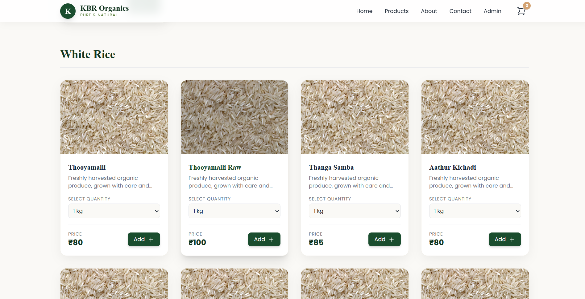
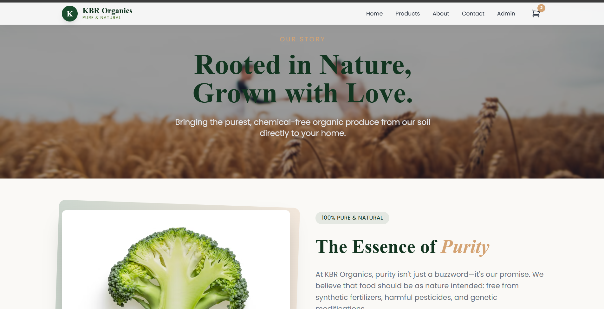

  

<h1 align="center">🌿 KBR ORGANICS – Pure & Natural</h1>

  <em>A modern, elegant and fully responsive full-stack web application for organic products.</em>

  
  
  
  
  

---

## ✨ Overview

**KBR Organics** is a complete full-stack web application designed for selling organic products with a smooth user experience, modern UI, and scalable backend API.

It includes:
- 🧭 React + Vite frontend  
- ⚙️ Node.js + Express backend  
- 🛢️ MongoDB database  
- 🎨 TailwindCSS UI  
- 📡 REST API with product management  

---

## 🎨 Project Screenshots

### 🏡 Homepage

### 🛒 Products Page

### 🌾 About / Story Page

---

## 🧩 Tech Stack

  
  
  
  
  
  

---

## 🔥 Features

### 🌐 Frontend (React + Vite)
- Fast SPA  
- Clean responsive UI  
- Product display & filtering  
- API integration using Axios  
- Modern routing with React Router  

### 🖥️ Backend (Node + Express)
- REST API architecture  
- MongoDB database  
- Modular routes, controllers, models  
- Environment-based config  
- Optional JWT authentication  

---

## 📁 Project Structure

KBR-Organics/
│
├── backend/
│ ├── controllers/
│ ├── models/
│ ├── routes/
│ ├── data/
│ ├── server.js
│ └── package.json
│
├── frontend/
│ ├── assets/
│ │ ├── kbr-banner.svg
│ │ ├── 1-home.png
│ │ ├── 2-products.png
│ │ └── 3-about.png
│ ├── public/
│ ├── src/
│ │ ├── components/
│ │ ├── context/
│ │ ├── App.jsx
│ │ ├── index.css
│ │ └── main.jsx
│ ├── vite.config.js
│ └── package.json
│
└── README.md